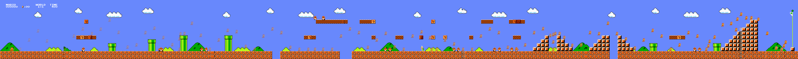

- 项目结构
```bash
.
├── LICENSE
├── mario_dqn                               --> 本次大作业相关代码：利用DQN算法训练《超级马里奥兄弟》智能体
│   ├── assets
│   │   ├── dqn.png                         --> 流程示意图
│   │   └── mario.gif                       --> mario游戏gif示意图
│   ├── evaluate.py                         --> 智能体评估函数
│   ├── __init__.py
│   ├── mario_dqn_main.py                   --> 智能体训练入口，包含训练的逻辑
│   ├── mario_dqn_config.py                 --> 智能体配置文件，包含参数信息       
│   ├── model.py                            --> 神经网络结构定义文件
│   ├── policy.py                           --> 策略逻辑文件，包含经验收集、智能体评估、模型训练的逻辑
│   ├── README.md
│   ├── requirements.txt                    --> 项目依赖目录
│   └── wrapper.py                          --> 各式各样的装饰器实现
└── README.md
```
# 本项目主要有两个亮点，1. 可视化，2.丰富的对比实验和多种子对比：
1. 长图的马里奥展示(mario_dqn_visualize)


2. 马里奥的各动作Q值显示

在顺利通关的前提下，只有2个动作时，马里奥在各个env_step的动作Q值


在顺利通关的前提下，只有7个动作时，马里奥在各个env_step的动作Q值


实验结果：
实验1视频：
mario_exp1_v0_7a_1f_seed2:

https://github.com/user-attachments/assets/beea96ef-d157-434d-b67a-61491cf74fda


实验2视频：
mario_exp2_v0_2a_1f_seed2：


https://github.com/user-attachments/assets/8a212a81-9a0e-494c-b1f0-aec7a1232444


实验3视频：
mario_exp3_v0_7a_4f_seed2:


https://github.com/user-attachments/assets/5f8e1717-3b68-4577-9748-1c9460f02677


实验4视频：
mario_exp4_v0_2a_4f_seed2:


https://github.com/user-attachments/assets/62e87434-b145-4e8a-b532-92a75f27c706


实验5视频：
mario_exp5_v1_2a_4f_seed2


https://github.com/user-attachments/assets/bd9ed5da-60a8-4564-a8e4-edb3177b0613


实验6视频：
mario_exp6_v1_12a_4f_s


https://github.com/user-attachments/assets/c101c8ab-a27d-4104-bbc0-c3ddfd525b9a


# 1.1 本项目使用uv进行包管理，只需要uv sync则可完成环境设置
```
uv sync
```


# 1.2进行虚拟环境
```
source  ./.venv/bin/activate  (linux)
./.venv/bin/activate.bat (windows)
```


# 1.3 运行测试
usage: mario_dqn_main.py [-h] [--seed SEED] [--version {0,1,2,3}] [--action {2,7,12}] [--obs {1,4}] [--resume_ckpt RESUME_CKPT]
```bash
# 对于每组参数，如果有服务器，计算资源充足，推荐设置三个种子（例如seed=0/1/2）进行3组实验，否则先运行一个seed。
python -u mario_dqn_main.py -s <SEED> -v <VERSION> -a <ACTION SET> -o <FRAME NUMBER>
# 以下命令的含义是，设置seed=0，游戏版本v0，动作数目为7（即SIMPLE_MOVEMENT），观测通道数目为1（即不进行叠帧）进行训练。
对比实验:


```
| 实验编号     | 实验目的                                                           | 游戏版本 (-v) | 动作空间 (-a)  | 堆叠帧数 (-o) | 其他 Wrapper | 分析要点                                                                                                    |
| :----------- | :----------------------------------------------------------------- | :------------ | :------------- | :------------ | :----------- | :---------------------------------------------------------------------------------------------------------- |
| **1**        | **基线 (Baseline)**：建立一个最基础的参照标准。                    | `v0` (原始)   | `7 (SIMPLE)`   | `1` (单帧)    | 无           | 记录 `reward_mean` 的最终水平和上升速度。这是所有后续实验的对比基准。很可能无法通关。                       |
| **2**        | **探索动作简化**：验证简化动作空间是否能加速学习。                 | `v0` (原始)   | 2 (极简)`      | `1` (单帧)    | 无           | 与**实验1**对比，查看 `reward_mean` 是否在训练早期上升更快。关注智能体是否学会了基础的前进和跳跃。          |
| **3**        | **探索堆叠帧**：在基线上增加时序信息，看是否能提升性能。           | `v0` (原始)   | `7 (SIMPLE)`   | `4` (四帧)    | 无           | 与**实验1**对比，`reward_mean` 是否有显著提升。智能体是否学会了更依赖于速度信息的动作（如助跑跳）。         |
| **4**        | **组合优化 (1)**：结合 **动作简化** 与 **堆叠帧** 这两个有效改动。 | `v0` (原始)   | `2 (极简)`     | `4` (四帧)    | 无           | 与**实验1、2、3**全面对比。这通常是一个效果不错的组合，重点观察 `reward_mean` 的上限和学习效率。            |
| **5**        | **组合优化 (2)**：在最佳组合基础上，**简化观测空间**以去除冗余。   | `v1` (降采样) | `2 (极简)`     | `4` (四帧)    | 无           | 与**实验4**对比，这是**最有希望通关**的配置。观察 `reward_mean` 是否能稳定达到3000分以上。                  |
| **6 (可选)** | **探索复杂动作**：验证更复杂的动作空间能否带来更高的性能上限。     | `v1` (降采样) | `12 (COMPLEX)` | `4` (四帧)    | 无           | 与**实验5**对比，训练前期 `reward_mean` 可能更低，但后期是否有潜力超越实验5？观察录像看是否学会了高级技巧。 |
| **7 (可选)** | **探索环境随机性**：在最佳配置上增加“粘性动作”，测试鲁棒性。       | `v1` (降采样) | `2 (极简)`     | `4` (四帧)    | StickyAction | 与**实验5**对比，`reward_mean` 可能会略微下降或波动更大，但训练出的智能体泛化能力和鲁棒性可能更强。         |
| **8 (可选)** | **探索奖励空间**：在最佳配置上增加“金币奖励”，看行为变化。         | `v1` (降采样) | `2 (极简)`     | `4` (四帧)    | CoinReward   | 与**实验5**对比，观察录像，看智能体是否会为了吃金币而偏离主线，甚至做出危险动作。                           |


# 1.5 退出tmux
在tmux中，ctrl+b 然后按d，回到tmux可以用tmux ls列出所有session，再tmux a [session]

# 1.4 查看训练日志：
```bash
tensorboard --logdir <exp_dir>
tendsorboard --logdir ~/WS/DI-adventure/mario_dqn/exp/v1_12a_4f_seed2/log
```

# 2 数据分析
---


### tensorboard 中指标含义如下
tensorboard结果分为 buffer, collector, evaluator, learner 四个部分，以\_iter结尾表明横轴是训练迭代iteration数目，以\_step结尾表明横轴是与环境交互步数step。
一般而言会更加关注与环境交互的步数，即 collector/evaluator/learner\_step。
#### evaluator
评估过程的一些结果，最为重要！展开evaluator_step，主要关注：
- reward_mean：即为任务书中的“episode return”。代表评估分数随着与环境交互交互步数的变化，一般而言，整体上随着交互步数越多（训练了越久），分数越高。
- avg_envstep_per_episode：每局游戏（一个episode）马里奥平均行动了多少step，一般而言认为比较长一点会好；如果很快死亡的话envstep就会很短，但是也不排除卡在某个地方导致超时的情况；如果在某一step突然上升，说明学到了某一个很有用的动作使得过了某一个难关，例如看到坑学会了跳跃。
#### collector
探索过程的一些结果，展开collector_step，其内容和evaluator_step基本一致，但是由于探索过程加了噪声（epsilon-greedy），一般reward_mean会低一些。
#### learner
学习过程的一些结果，展开learner_step：
- q_value_avg：Q-Network的输出变化，在稳定后一般是稳固上升；
- target_q_value_avg：Target Q-Network的输出变化，和Q-Network基本上一致；
- total_loss_avg：损失曲线，一般不爆炸就不用管，这一点和监督学习有很大差异，思考一下是什么造成了这种差异？
- cur_lr_avg：学习率变化，由于默认不使用学习率衰减，因此会是一条直线；
#### buffer
DQN是off-policy算法，因此会有一个replay buffer用以保存数据，本次大作业不用太关注buffer；

总体而言，看看evaluator_step/reward_mean，目标是在尽可能少的环境交互步数能达到尽可能高的回报，一般而言3000分可以认为通关1-1。

## 对智能体性能进行评估，并保存录像：
```bash
python3 -u evaluate.py -ckpt <CHECKPOINT_PATH> -v <VERSION> -a <ACTION SET> -o <FRAME NUMBER>

python3 -u evaluate.py -ckpt ~/WS/DI-adventure/mario_dqn/exp/v0_2a_1f_seed2/ckpt/ckpt_best.pth.tar  -v 0 -a 2 -o 1
python3 -u evaluate.py -e 1 -s 2
```

具体而言，对于你想要分析的智能体，从：
1. tensorboard结果曲线；
2. 游戏录像；
3. 类别激活映射CAM；

三个角度入手分析即可。
# 4. 特征处理
- 包括对于观测空间（observation space）、动作空间（action space）和奖励空间（reward space）的处理；
- 这一部分主要使用 wrapper 来实现，什么是 wrapper 可以参考：
    1. [如何自定义一个 ENV WRAPPER](https://di-engine-docs.readthedocs.io/zh_CN/latest/04_best_practice/env_wrapper_zh.html)
    2. [Gym Documentation Wrappers](https://www.gymlibrary.dev/api/wrappers/)

可以对以下特征空间更改进行尝试：
### 观测空间（observation space）
- 图像降采样，即将游戏版本从`v0`更改为`v1`，游戏版本的内容请参照[mario游戏仓库](https://github.com/Kautenja/gym-super-mario-bros)：`-v 1`；
- 堆叠四帧作为输入，即输入变为`(4,84,84)`的图像：`-o 4`；
    - 叠帧wrapper可以将连续多帧的图像叠在一起送入网络，补充mario运动的速度等单帧图像无法获取的信息；
- 图像内容简化（尝试游戏版本`v2`、`v3`的效果）：`-v 2/3`；
### 动作空间（action space）
- 动作简化，将 `SIMPLE_ACTION` 替换为 `[['right'], ['right', 'A']]`：`-a 2`；
    - mario提供了不同的[按键组合](https://github.com/Kautenja/gym-super-mario-bros/blob/master/gym_super_mario_bros/actions.py)，有时候简化动作种类能有效降低训练前期学习的困难，但可能降低操作上限；
- 增加动作的多样性，将 `SIMPLE_ACTION` 替换为 `COMPLEX_MOVEMENT`：`-a 12`；
    - 也许能提高上限；
- 粘性动作 sticky action（给环境添加 `StickyActionWrapper`，方式和其它自带的 wrapper 相同，即`lambda env: StickyActionWrapper(env)`）
    - 粘性动作的含义是，智能体有一定概率直接采用上一帧的动作，可以增加环境的随机性；
### （拓展）奖励空间（reward space）

目前mario的奖励请参照[mario游戏仓库](https://github.com/Kautenja/gym-super-mario-bros)
- 尝试给予金币奖励（给环境添加 `CoinRewardWrapper`，方式和其它自带的 wrapper 相同）；
    - 能否让mario学会吃金币呢；
- 稀疏 reward，只有死亡和过关才给reward（给环境添加 `SparseRewardWrapper`，方式和其它自带的 wrapper 相同）
    - 完全目标导向。稀疏奖励是强化学习想要落地必须克服的问题，有时候在结果出来前无法判断中途的某个动作的好坏；

**由于同学们计算资源可能不是特别充分，这里提示一下，图像降采样、图像内容简化、叠帧、动作简化是比较有效能提升性能的方法！**

以下是非常缺少计算资源和时间，最小限度需要完成的实验任务：
1. baseline（即`v0+SIMPLE MOVEMENT+1 Frame`）跑一个seed看看结果； (python3 -u mario_dqn_main.py -s 2 -v 0 -a 2 -o 1)
2. 尝试简化动作空间的同时进行叠帧（即`v0+[['right'], ['right', 'A']]+4 Frame`）跑一个seed看看；(python3 -u mario_dqn_main.py -s 2 -v 0 -a 2 -o 4)
3. 观测空间去除冗余信息（即`v1+[['right'], ['right', 'A']]+4 Frame`）跑一个seed看看，如果没通关则试试换个seed；  (run )
4. 从tensorboard、可视化、CAM以及对特征空间的修改角度分析通关/没有通过的原因。

对于有充足计算资源的同学，推荐增加实验的seed、延长实验步长到5M、更换其它游戏版本、尝试其它动作观测空间组合，使用其它的wrapper、以及free style；

---
**新增：一些实验[结果](https://github.com/opendilab/DI-adventure/blob/results/mario_dqn/README.md)供大家参考！**
**新增：分析[思路/范例](https://github.com/opendilab/DI-adventure/tree/analysis/mario_dqn)供大家参考！**
# 对于大作业任务书的一些补充说明：
**如果不知道接下来要做什么了，请参考任务书或咨询助教！！！**
- “3.2【baseline 跑通】（3）训练出能够通关简单级别关卡（1-1 ~~，1-2~~ ）的智能体”。 考虑到算力等因素，大家只需要关注关卡1-1即可。
- “3.2【baseline 跑通】~~（5）查看网络预测的 Q 值与实际 Q 值，判断当前是否存在高估或者低估问题;~~”。没有提供实际Q值，这一点要求去掉。
- “3.4【结果分析】20 分”，不需要每一组参数都分析，选择有代表性或你想要分析的参数与wrapper组合，从tensorboard结果曲线、评估视频与CAM激活图三个方面出发分析即可。由于视频无法放入实验报告与海报，对有意思的部分进行截图插入即可。
